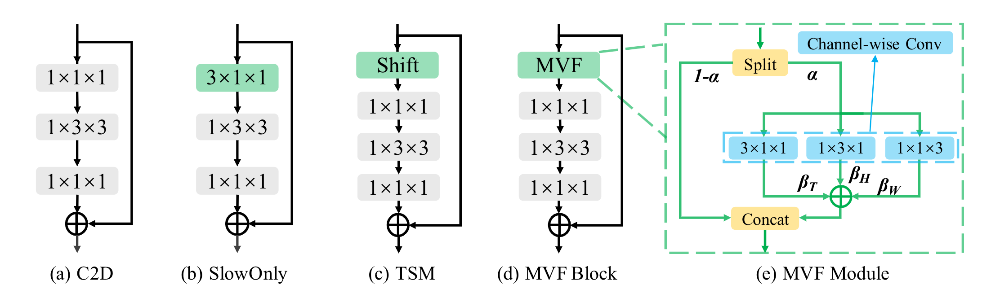

# MVFNet: Multi-View Fusion Network for Efficient Video Recognition (AAAI 2021)
  


## Overview
We release the code of the [MVFNet](https://arxiv.org/abs/2012.06977) (Multi-View Fusion Network). The core code to implement the Multi-View Fusion Module is `codes/models/modules/MVF.py`.

**[Mar 24, 2021]**  We has released the code of MVFNet.

**[Dec 20, 2020]**  MVFNet has been accepted by **AAAI 2021**.

* [Prerequisites](#Prerequisites)
* [Data Preparation](#data-preparation)
* [Model Zoo](#model-zoo)
* [Testing](#testing)  
* [Training](#training)  


## Prerequisites

All dependencies can be installed using pip:

```sh
python -m pip install -r requirements.txt
```

Our experiments run on Python 3.7 and PyTorch 1.5. Other versions should work but are not tested.

## Download Pretrained Models

- Download ImageNet pre-trained models

```sh
cd pretrained
sh download_imgnet.sh
```
- Download K400 pre-trained models
TODO


## Data Preparation
Please refer to [DATA](./data_process/DATASETS.md) for data preparation.


## Model Zoo

| Architecture | Dataset | T x interval |  Top-1 Acc. | Pre-trained model |
|:------------:|:-------------------:|:------------------:|:-----------------:|:--------------:|:--------------:|
|     MVFNet-ResNet50    |     Kinetics-400    |        4x16       |   74.2%   |   [Download link](...) |
|     MVFNet-ResNet50    |     Kinetics-400    |        8x8       |   76.0%   |   [Download link](...) |
|     MVFNet-ResNet50    |     Kinetics-400    |        16x4       |   77.0%   |   [Download link](...) |
|     MVFNet-ResNet101    |     Kinetics-400    |        4x16       |    76.0%  |   [Download link](...) |
|     MVFNet-ResNet101    |     Kinetics-400    |        8x8       |    77.4%  |   [Download link](...) |
|     MVFNet-ResNet101    |     Kinetics-400    |        16x4       |   78.4%   |   [Download link](...)|


## Testing

- For 3 crops, 10 clips, the processing of testing

```sh
# Dataset: Kinetics-400
# Architecture: R50_8x8 ACC@1=76.0%
bash scripts/dist_test_recognizer.sh configs/MVFNet/K400/mvf_kinetics400_2d_rgb_r50_dense.py ckpt_path 8 --fcn_testing
```

## Training
This implementation supports multi-gpu, `DistributedDataParallel` training, which is faster and simpler. 

- For example, to train TDN-ResNet50 on Kinetics400 with 8 gpus, you can run:

```sh
bash scripts/dist_train_recognizer.sh configs/MVFNet/K400/mvf_kinetics400_2d_rgb_r50_dense.py 8
```

## Acknowledgements
We especially thank the contributors of the [mmaction](https://github.com/open-mmlab/mmaction) codebase for providing helpful code.


## License
This repository is released under the Apache-2.0. license as found in the [LICENSE](LICENSE) file.


## Citation
If you think our work is useful, please feel free to cite our paper 😆 :
```
@inproceedings{wu2020MVFNet,
  author    = {Wu, Wenhao and He, Dongliang and Lin, Tianwei and Li, Fu and Gan, Chuang and Ding, Errui},
  title     = {MVFNet: Multi-View Fusion Network for Efficient Video Recognition},
  booktitle = {AAAI},
  year      = {2021}
}
```


## Contact
For any question, please file an issue or contact
```
Wenhao Wu: wuwenhao17@mails.ucas.edu.cn
```